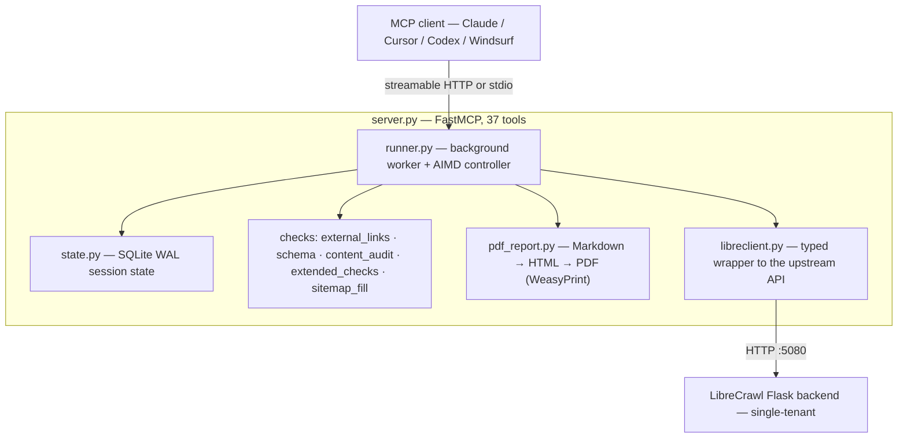

# Architecture

The system is two processes: a thin **MCP wrapper** your AI assistant talks to, and the **LibreCrawl engine** that does the actual crawling. The wrapper adds the things an AI-native workflow needs — background/chunked crawling, adaptive politeness, SEO checks, report generation, and ephemeral cleanup — on top of LibreCrawl's crawl API.

## Components

### `server.py` — the MCP surface
FastMCP application registering all 37 tools. Owns the authenticated HTTP client to LibreCrawl (`get_client()` logs in once and reuses the session cookie) and the base URL (`LIBRECRAWL_URL`, or `http://127.0.0.1:<LIBRECRAWL_PORT>`). Serves either streamable HTTP (`MCP_HOST:MCP_PORT/mcp`) or stdio, chosen by `MCP_TRANSPORT`.

### `runner.py` — background worker + AIMD controller
Chunked audits run here on a background worker thread so the MCP call returns a `session_id` in under 2 seconds instead of blocking. The **AIMD controller** (Additive-Increase/Multiplicative-Decrease, the same idea as TCP congestion control) tunes crawl delay live: error rate over ~10% halves the chunk and doubles the delay; p95 latency over ~1.5× target stretches the delay; clean signals ease off additively. It respects the `robots.txt` `Crawl-Delay` floor. This is what keeps big, heavy origins healthy without manual tuning.

### `state.py` — session state
Persists per-session progress to SQLite in WAL mode. Because progress is on disk, an audit survives a restart of the MCP process or client mid-crawl and can be resumed.

### `libreclient.py` — typed upstream wrapper
A small, typed layer over LibreCrawl's HTTP API (start/stop/pause/resume crawl, status snapshots, export). Reuses `server.py`'s authenticated client so there's a single login. Also derives per-chunk metrics (p95 latency, error rate) that feed the AIMD controller.

### Check modules
`external_links.py` (outbound-link validation into 17 status classes), `schema_validator.py` (schema.org + Google Rich Results, `@graph` aware), `content_audit.py` (readability, AI-tells, boilerplate), `extended_checks.py` (the bulk of the 50+ technical checks), `sitemap_fill.py` (pulls in sitemap URLs not linked internally, so orphan pages are audited too).

### `pdf_report.py` — reporting
Turns the audit's Markdown report into a branded PDF: Markdown → HTML (`markdown`) → PDF (`WeasyPrint`). WeasyPrint needs system libraries (Pango, Cairo) — these are baked into the Docker image.

### LibreCrawl backend
The upstream open-source [LibreCrawl](https://github.com/PhialsBasement/LibreCrawl) Flask app crawls sites and extracts raw SEO data. It's single-tenant (one crawl at a time), so the MCP serializes audits.

## The session-persistence patch

LibreCrawl reads its `session_id` before the crawler that creates it is initialized, which leaves `crawl_id` null and prevents results from being written to its database — audits come back empty. The Docker image applies a small patch (`docker/patch-librecrawl.py`) that moves the `session_id` read to after `get_or_create_crawler()`. If you run LibreCrawl yourself (not via this repo's Docker image), apply the same patch, or use the one-liner installer, which applies it for you.

## Ephemeral by design

When you download an audit with `auto_cleanup=True`, the server deletes the session row, every artifact file on disk, and the upstream LibreCrawl crawl record. Per-audit server footprint after cleanup: 0 bytes, 0 rows. Your downloaded zip is the only remaining copy.
